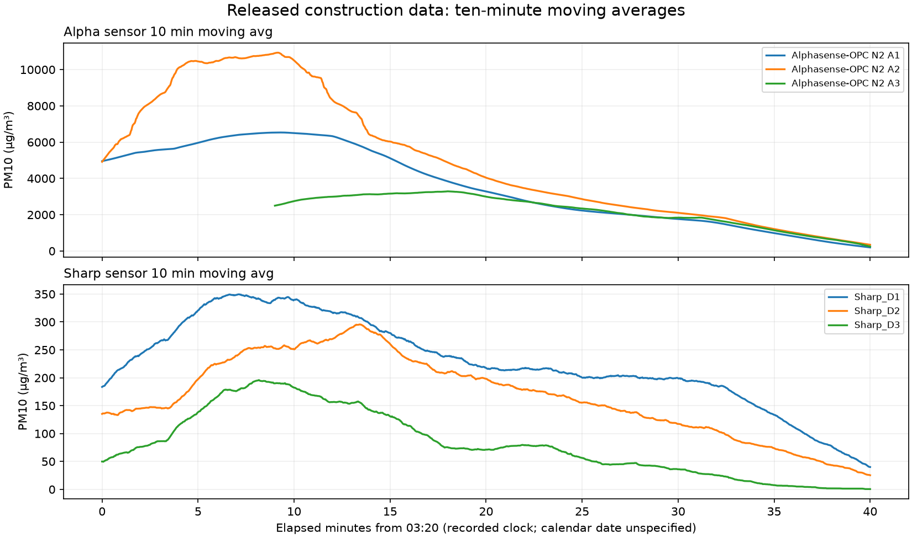
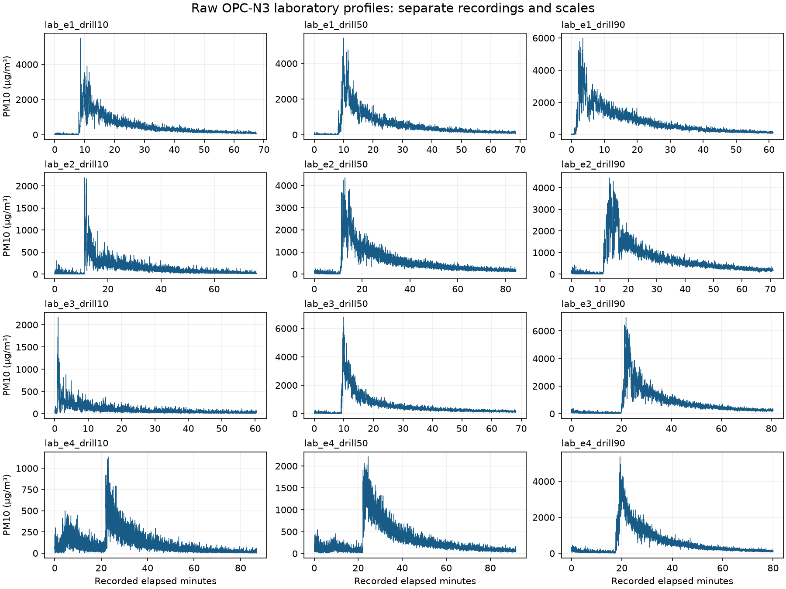

# Construction dataset audit

Audited 1 October 2026, Asia/Dhaka. No model training or accuracy evaluation was performed in this audit.

## 2020 candidate: rejected for the planned raw 30-second task

Source: Daniel Cheriyan, [Mendeley Data V1](https://data.mendeley.com/datasets/6fd493866k/1), DOI `10.17632/6fd493866k.1`, CC BY 4.0. File: `DIB -data.xlsx`, 189,414 bytes. The downloaded SHA-256 matches the repository's published hash:

```text
42c273d1f89c7d57181478334547934a049637f109e31d7f8132f9c29ecdb613
```

The published page describes PM10, PM2.5 and PM1, and the [associated article](https://pmc.ncbi.nlm.nih.gov/articles/PMC7644872/) calls the linked resource raw. The actual workbook has three sheets: `Alpha sensor 10 min moving avg`, `Sharp sensor 10 min moving avg`, and `Description of dataset`. Its description explicitly identifies both measurement sheets as **PM10 filtered to ten-minute moving averages**. PM2.5, PM1 and unfiltered channels are absent from this file.

The moving-average alignment and edge treatment are unspecified. There are no formulas from which to reconstruct how the averaging was done. A two-second output cadence does not undo ten minutes of smoothing. We cannot prove that past inputs exclude future raw readings, and a 30-second target would chiefly measure predictability of an already smoothed signal. This file is rejected for raw short-horizon forecasting. It remains an attributed descriptive construction trace, with its processing clearly identified.

### Actual structure and coverage

Both measurement sheets contain 1,201 populated data rows, Excel rows 3–1203. Their recorded time-of-day runs from 03:20:00 through 04:00:00, inclusive, with 1,200 consecutive two-second intervals. Calendar date and timezone are absent. There are no duplicate times, reversed times or cadence gaps. Stored sheet dimensions extend beyond populated records; formatted empty rows/columns are not observations.

| Channel | Observed | Missing | Minimum PM10, µg/m³ | Maximum PM10, µg/m³ |
|---|---:|---:|---:|---:|
| OPC-N2 A1 | 1,201 | 0 | 195.74 | 6,532.42 |
| OPC-N2 A2 | 1,201 | 0 | 344.56 | 10,931.21 |
| OPC-N2 A3 | 931 | 270 | 246.12 | 3,288.91 |
| Sharp D1 | 1,201 | 0 | 40.03 | 349.53 |
| Sharp D2 | 1,201 | 0 | 25.33 | 295.70 |
| Sharp D3 | 1,201 | 0 | 0.50 | 195.93 |

A3 is missing its first 270 rows, from 03:20:00 through 03:28:58. No observed numeric values are negative, zero or nonfinite. The published article reports that the Sharp sensor saturation range was exceeded during the experiment and excludes Sharp from further analysis. Averaged released Sharp values cannot recover those saturated raw measurements. OPC channels contain no identical ceiling plateau, which alone does not establish calibration or a valid upper range.

The workbook describes four minutes of preparation, sixteen minutes of mixing and twenty minutes of block laying. Monitors were 1 m horizontally from the source and 0.8 m above the floor. There is **one construction experiment**, with simultaneous co-located sensors. The file contains no wind, boundary monitors, misting intervention, independent field episodes or source-emission-rate measurement. It does not validate outdoor transport or containment.

### Reproduction and outputs

```sh
python3 scripts/download_data.py --dataset 6fd493866k
python3 scripts/audit_filtered_candidate.py
```

Install `requirements-audit.txt` in a project environment before running the second command. The pinned environment was verified on Python 3.14.6 / Apple M4; numeric extraction was also cross-checked using the bundled Python 3.12 libraries. Original files are unchanged and ignored by Git. Aggregate findings are in [the machine-readable summary](../reports/data-audit/mendeley-2020-summary.json).



Derived plot credit: Daniel Cheriyan, DOI `10.17632/6fd493866k.1`, CC BY 4.0. The transformation plots the supplied moving-average channels against elapsed time. These outputs are audit evidence, not model results.

## 2024 replacement: accepted for a preliminary laboratory monitor forecast

Source: Komiljon Askarov and Jae-ho Choi, [Mendeley Data V1](https://data.mendeley.com/datasets/7f22n9v7hp/1), DOI `10.17632/7f22n9v7hp.1`, CC BY 4.0. The 5,312,710-byte ZIP matches its published SHA-256:

```text
7aa66322a8440e1e353440616685ece43d9abb2af9d6a63971f224896816eadb
```

The outer ZIP contains `Data.zip`. That nested archive contains 56 actual files, separating `Raw`/`Raw data` logs from `Analysed` workbooks. An [inventory of member names, sizes and hashes](../reports/data-audit/mendeley-2024-inventory.json) is committed. The archives are read in memory without altering or blindly extracting their contents.

There are twelve OPC-N3 laboratory recordings: four labelled experiment groups, each containing 10-, 50- and 90-second drilling-labelled trials. Two further OPC files are outdoor recordings. Other devices' logs and analysed workbooks are retained in the archive but excluded from the first model; inter-device alignment/calibration is a separate task.

### Accepted fields and coverage

Raw OPC CSV exports have a metadata preamble followed by `OADateTime` and explicitly unit-labelled fields. We select **`PM10(ug/m3)`**, not `RollMean_PM10`. Measured `PM1(ug/m3)`, `PM2.5(ug/m3)`, `Temperature(C)` and `RelativeHumidity(%)` also exist. The first feature set uses only past PM10. Sampling period and sample flow are available for quality review, not silently interpreted as environmental wind.

| Recording | Raw rows | Duration, min | Duplicate timestamps | Intervals over 1.5 s |
|---|---:|---:|---:|---:|
| lab_e1_drill10 | 4,037 | 67.50 | 0 | 0 |
| lab_e1_drill50 | 4,082 | 68.54 | 0 | 0 |
| lab_e1_drill90 | 3,654 | 61.27 | 0 | 0 |
| lab_e2_drill10 | 4,547 | 75.90 | 0 | 0 |
| lab_e2_drill50 | 5,062 | 84.36 | 0 | 0 |
| lab_e2_drill90 | 4,259 | 71.03 | 0 | 0 |
| lab_e3_drill10 | 3,623 | 60.37 | 0 | 0 |
| lab_e3_drill50 | 4,095 | 68.24 | 0 | 0 |
| lab_e3_drill90 | 4,837 | 80.73 | 0 | 0 |
| lab_e4_drill10 | 5,202 | 86.85 | 0 | 1 |
| lab_e4_drill50 | 5,499 | 91.67 | 0 | 2 |
| lab_e4_drill90 | 4,820 | 80.03 | 18 | 1 |
| outdoor_day1 | 3,673 | 61.63 | 6 | 32 |
| outdoor_day2 | 4,019 | 67.48 | 0 | 0 |

Totals: **53,717 laboratory rows**, covering about 14.94 recorded hours, plus **7,692 outdoor rows**. Median record intervals are approximately 1.00–1.01 seconds. The instrument's separate integration-period field must not be mistaken for the logging cadence. Selected pollutant/context fields have no blank or nonfinite values, and PM fields have no negative readings. Laboratory PM10 ranges from 0.05 to 6,994.40 µg/m³. Each recording's maximum occurs once; this rules out an identical maximum plateau in these exports but does not establish absence of sensor bias or calibration error.

Nine lab OPC files contain OLE Automation dates; three contain only time-of-day strings despite the `OADateTime` header. Those three are `lab_e3_drill10`, `lab_e4_drill50` and `lab_e4_drill90`. No calendar date or timezone is invented. Dates elsewhere show that folder group numbers do not form a strict chronological ordering. All first-model clocks use elapsed time within their own recordings.

No pair of OPC files has an identical ten-row sequence of raw PM1/PM2.5/PM10 triplets. Every OPC member hash and full pollutant-sequence hash is distinct. This is a duplicate-content check; it does not prove statistical independence or cross-site coverage. The four published groups are preserved as experimental units for splitting.

### Frozen task and quality rules

[The task configuration](../configs/forecast-task.json) defines a 30-second forecast of the latest raw OPC-N3 PM10 snapshot, using the preceding 120 seconds. Build a one-second elapsed grid with the latest observation at or before each grid time. Keep the last original row for duplicate logged times and report the removals. A snapshot more than 1.5 seconds old is unavailable. Reject windows with an unavailable history or target; no centered smoothing, backward filling or future interpolation is allowed. Include both lookback endpoints: 121 one-second snapshots.

Train on every recording in groups 1/2 (25,641 raw rows), select models using all of group 3 (12,555), and reserve all of group 4 (15,521) for the final test. Raw counts are not prepared sample counts; D2 will publish those after causal gridding. Keep each recording intact and never bridge its history into another. This is a whole-group holdout, not a globally chronological split. Group 4's files are labelled temperature increased, so the test also contains a changed condition that must be disclosed. Keep outdoor data outside the initial task.

Do not use elapsed event time, drilling duration, experiment ID or future activity labels as learned features. Do not inspect final model test performance during selection. Calendar uncertainty, one instrument/setup, repeated experimental conditions and lack of boundary/misting measurements limit the claim to a preliminary laboratory signal forecast.

### Reproduction and quality plots

```sh
python3 -m venv .venv
.venv/bin/python -m pip install -r requirements-audit.txt
.venv/bin/python scripts/download_data.py --dataset 7f22n9v7hp
.venv/bin/python scripts/audit_raw_profiles.py
```

The [machine-readable audit](../reports/data-audit/mendeley-2024-summary.json) contains channel distributions, dates, cadence diagnostics and duplicate checks. The initial download hit a 60-second timeout on this connection; the downloader now allows 300 seconds and verified the completed file. A cached rerun verifies source metadata and the local file hash again.



Derived plot credit: Komiljon Askarov and Jae-ho Choi, DOI `10.17632/7f22n9v7hp.1`, CC BY 4.0. The transformation plots each raw PM10 recording against its elapsed clock, with separate panel scales. Spikes and decay can be inspected without interpreting them as calibrated emissions or simulated control effects.

The related 2019 candidate's page also explicitly describes ten-minute filtered PM10. It is not an assumed independent raw-data alternative. UCI's hourly ambient data remains a separate native-hourly fallback rather than evidence for the construction forecast.
